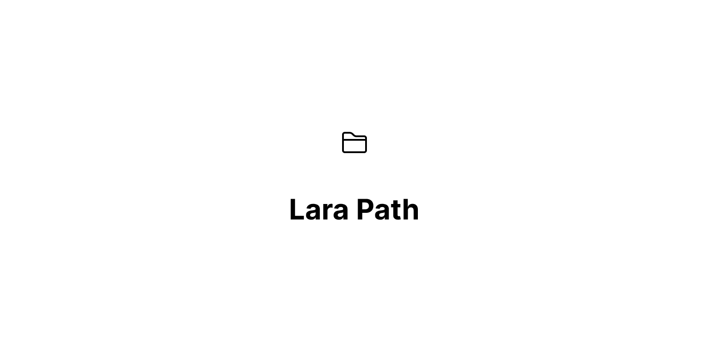

# LaraPath

[](https://github.com/hdaklue/LaraPath/actions)
[](https://packagist.org/packages/hdaklue/larapath)
[](https://packagist.org/packages/hdaklue/larapath)


A secure, fluent path builder for PHP with sanitization strategies and Laravel 10-12 integration.

## Features

- 🔒 **Security First**: Built-in protection against directory traversal attacks
- 🎯 **Fluent API**: Clean, readable path building with method chaining
- 🔧 **Sanitization Strategies**: Multiple strategies for different use cases (hash, slug, snake_case, timestamp)
- 🚀 **Immutable Operations**: Thread-safe path building with no side effects
- 🏗️ **Strategy Pattern**: Extensible sanitization system
- 🎨 **Type Safety**: Full type hints and IDE autocompletion
- 📦 **Laravel Integration**: Optional Laravel Storage facade integration

## Installation

```bash
composer require hdaklue/larapath
```

## Quick Start

```php
use Hdaklue\PathBuilder\PathBuilder;
use Hdaklue\PathBuilder\Enums\SanitizationStrategy;
// Or use the facade in Laravel
use LaraPath;

// Basic usage (static)
$path = PathBuilder::base('uploads')
    ->add('images')
    ->add('avatar.jpg')
    ->toString(); // "uploads/images/avatar.jpg"

// Laravel facade usage (auto-registered)
$path = LaraPath::base('uploads')
    ->add('images') 
    ->add('avatar.jpg')
    ->toString();

// With sanitization strategies
$path = PathBuilder::base('uploads')
    ->add('user-123', SanitizationStrategy::HASHED)
    ->add('My File.jpg', SanitizationStrategy::SLUG)
    ->validate()
    ->toString(); // "uploads/a665a45920422f9d417e4867efdc4fb8/my-file.jpg"
```

## Usage Examples

### Sanitization Strategies

```php
// Hash sensitive data
$path = PathBuilder::base('storage')
    ->add('user@email.com', SanitizationStrategy::HASHED)
    ->toString(); // "storage/5d41402abc4b2a76b9719d911017c592"

// Create URL-friendly names  
$path = PathBuilder::base('uploads')
    ->add('My Amazing File!', SanitizationStrategy::SLUG)
    ->toString(); // "uploads/my-amazing-file"

// Convert to snake_case
$path = PathBuilder::base('files')
    ->add('CamelCase Name', SanitizationStrategy::SNAKE)
    ->toString(); // "files/camel_case_name"

// Add timestamps for uniqueness
$path = PathBuilder::base('temp')
    ->add('session', SanitizationStrategy::TIMESTAMP)
    ->toString(); // "temp/session_1640995200"
```

### Path Operations

```php
$builder = PathBuilder::base('files/video.mp4');

// Extract path components
$extension = $builder->getExtension(); // "mp4"
$filename = $builder->getFilename(); // "video.mp4"
$filenameWithoutExt = $builder->getFilenameWithoutExtension(); // "video"
$directory = $builder->getDirectoryPath(); // "files"

// Modify paths
$newPath = $builder->replaceExtension('webm')->toString(); // "files/video.webm"
```

### Laravel Integration

LaraPath is automatically registered in Laravel applications with facade support and container binding.

```php
// Using the facade (recommended for Laravel)
use LaraPath;

$exists = LaraPath::base('uploads')
    ->add('avatar.jpg')
    ->exists('public'); // Uses Storage::disk('public')->exists()

// Using container binding
$builder = app('larapath');
$size = $builder->base('files')
    ->add('document.pdf')
    ->size(); // Uses Storage::size()

// Using static methods (framework-agnostic)
use Hdaklue\PathBuilder\PathBuilder;

$url = PathBuilder::base('images')
    ->add('logo.png')
    ->url('public'); // Uses Storage::disk('public')->url()

// Delete file
$deleted = LaraPath::base('temp')
    ->add('cache.tmp')
    ->delete(); // Uses Storage::delete()
```

### Validation and Security

```php
// Automatic validation
$path = PathBuilder::base('uploads')
    ->add('../../../etc/passwd') // Dangerous path
    ->validate() // Throws InvalidArgumentException
    ->toString();

// Manual safety check
$isSafe = PathBuilder::isSafe('uploads/../dangerous/path'); // false
```

### Custom Strategies

```php
use Hdaklue\PathBuilder\Contracts\SanitizationStrategyContract;

class UuidStrategy implements SanitizationStrategyContract
{
    public static function apply(string $input): string
    {
        return \Str::uuid()->toString();
    }
}

// Use custom strategy
$path = PathBuilder::base('files')
    ->add('temp-file', UuidStrategy::class)
    ->toString(); // "files/550e8400-e29b-41d4-a716-446655440000"
```

## API Reference

### PathBuilder Methods

- `PathBuilder::base(string $path, ?SanitizationStrategy $strategy = null): self`
- `add(string $name, ?SanitizationStrategy $strategy = null): self`
- `addFile(string $filename, ?SanitizationStrategy $strategy = null): self`
- `addTimestampedDir(): self`
- `addHashedDir(string $input, string $algorithm = 'md5'): self`
- `replaceExtension(string $newExt): self`
- `getExtension(): string`
- `getFilename(): string`
- `getFilenameWithoutExtension(): string`
- `getDirectoryPath(): string`
- `ensureTrailing(): self`
- `removeTrailing(): self`
- `validate(): self`
- `toString(): string`

### Laravel Integration Methods

- `mustExist(string $disk = 'local'): self`
- `mustNotExist(string $disk = 'local'): self`
- `exists(string $disk = 'local'): bool`
- `size(string $disk = 'local'): int`
- `url(string $disk = 'local'): string`
- `delete(string $disk = 'local'): bool`

### Static Utility Methods

- `PathBuilder::build(array $segments): string`
- `PathBuilder::join(string ...$segments): string`
- `PathBuilder::normalize(string $path): string`
- `PathBuilder::isSafe(string $path): bool`
- `PathBuilder::buildRelativePath(string $absolutePath, string $basePath): string`

## Available Strategies

- `SanitizationStrategy::HASHED` - MD5 hash of input
- `SanitizationStrategy::SLUG` - URL-friendly slug
- `SanitizationStrategy::SNAKE` - snake_case conversion
- `SanitizationStrategy::TIMESTAMP` - Appends Unix timestamp

## Requirements

- PHP ^8.2
- illuminate/support ^10.0|^11.0|^12.0 (for Laravel integration)

## Testing

```bash
composer test
```

## License

MIT License. See [LICENSE](LICENSE) for details.

## Contributing

Please see [CONTRIBUTING.md](CONTRIBUTING.md) for details.

## Security

If you discover any security related issues, please email hassan@daklue.com instead of using the issue tracker.